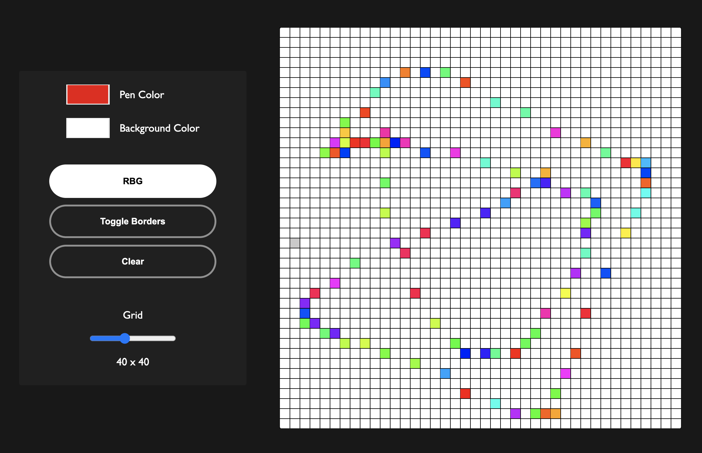

# odin-etch-a-sketch

### Description
#### This is the the result of my take for the Odin Project "etch-a-sketch" project. 

### Features
* You are able to choose your pen color, background color, toggle borders, randomized RGB color without your painted grid disappearing. 
* You can choose a grid between 1x1 to 100x100. The grid updates as you slide the slider. While it is obviously very slow to have it updating on every slide, it adds a dynamic element that it would not have until it waited for a final value. 
* The event listener waits for both hover, and mousedown to paint. 
* The Clear button clears just the grid and remembers your options. 

